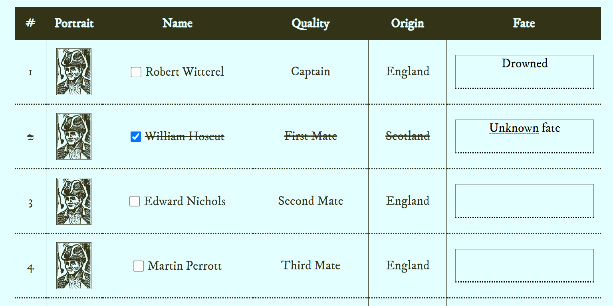

# Interactive Obra Dinn Crew list

An online tool to bring collaborative gameplay to the game 'Return of the Obra Dinn' in educational environments. 
The website is currently hosted using [GitHub Pages](https://sondregronas.github.io/obra-dinn-interactive-crew-list/).

## In development
This tool currently does not feature a convenient fate selector or a way to define fate based on the character's portrait, like how it is in the game.
Only when you know the character's name you'll be able to properly write your notes.

## How to use
You'll still need a copy of Obra Dinn in order to play, obviously.

1. Have your copy of the game running on the big screen in the classroom.
2. Split the class into teams, and have them open the website on their own devices.
3. Discuss the clues you find, and attempt to pinpint the fates of each crew member.
4. Solve the mysteries together!

## Disclaimer
This project is in no way affiliated with Lucas Pope or his game Return of the Obra Dinn. 
All data and images are property of Lucas Pope and his team.
