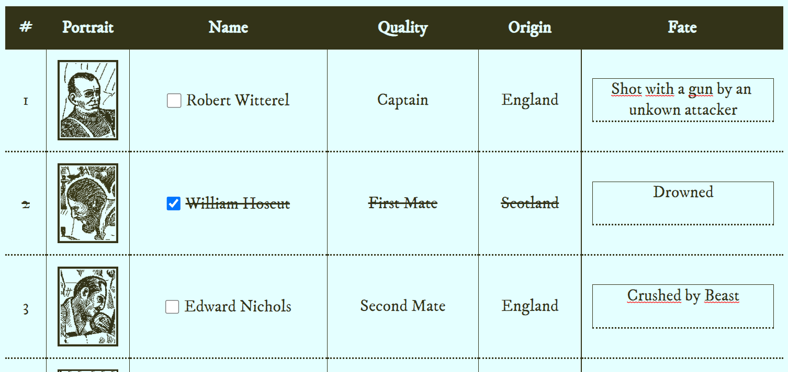

# Interactive Obra Dinn Crew list

An online tool to bring collaborative gameplay to the game 'Return of the Obra Dinn' in educational environments.

The tool is available at: https://sondregronas.github.io/obra-dinn-interactive-crew-list/

Note: This project is still a work in progress.

## How to use
You still need to have a copy of Obra Dinn in order to play, this is just a tool to help you play with multiple people.

1. Have your copy of the game running on the big screen in the classroom.
2. Split the class into teams, and have them open the website on their own devices.
3. Discuss the clues you have found, and try to figure out the fates of the crew members.
4. Solve the mysteries together!

## Disclaimer
This project is in no way affiliated with Lucas Pope or his game Return of the Obra Dinn.
All data and images are property of Lucas Pope and his team.
